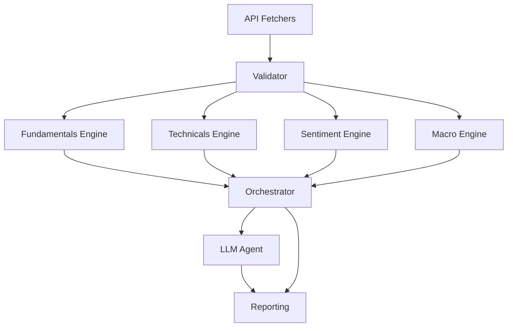

# Pipeline Overview

This document describes the architecture and flow of the AlphaLensAI pipeline, designed for robust, explainable, and modular equity research.

## Architecture

**Modules:**

1. **Orchestrator**
   - Coordinates the flow between all modules and agents.
   - Manages execution order, error handling, and reporting.

2. **Engines**
   - **Fundamentals**: Analyzes financial statements, growth, profitability, and capital structure.
   - **Technicals**: Evaluates price trends, momentum, support/resistance, and technical signals.
   - **Sentiment**: Aggregates analyst ratings, insider activity, news sentiment, and market positioning.
   - **Macro**: Assesses macroeconomic factors, sector trends, and external risks.

3. **Tools**
   - **API Fetchers**: Deterministically retrieve data from external sources.
   - **Validator**: Enforces schema and data integrity for all inputs/outputs.

4. **Reporting**
   - Formats and outputs results according to contract definitions.
   - Ensures auditability and traceability.

5. **LLM Agent**
   - Handles reasoning, gap-filling, and narrative generation when deterministic tools are insufficient.

6. **Models**
   - All data contracts are defined using Pydantic models for type safety and validation.

## Pipeline Flow

1. **Data Ingestion**: API Fetchers collect raw data, which is validated for integrity.
2. **Analysis**: Engines process validated data in parallel, each producing typed outputs.
3. **Orchestration**: The Orchestrator aggregates engine outputs, applies business logic, and coordinates LLM agent calls if needed.
4. **LLM Reasoning**: LLM agent fills gaps, synthesizes narrative, and answers complex queries.
5. **Reporting**: Final output is formatted, validated, and delivered with full audit trail.

## Extensibility

- New engines, tools, or reporting modules can be added with minimal changes to the orchestrator.
- All modules communicate via strongly typed Pydantic models.
